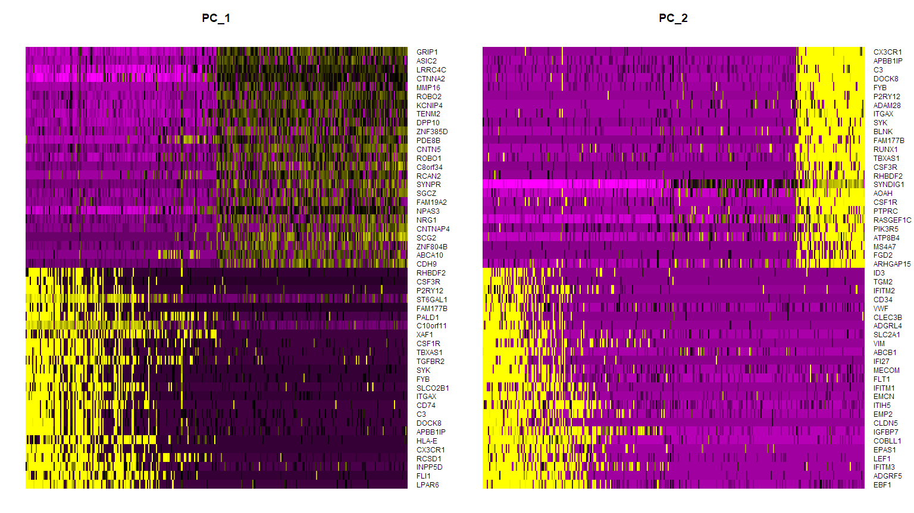
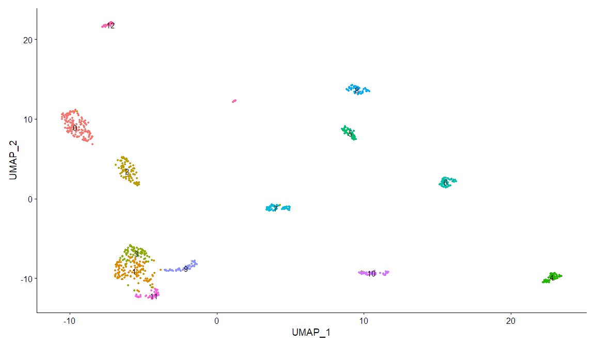
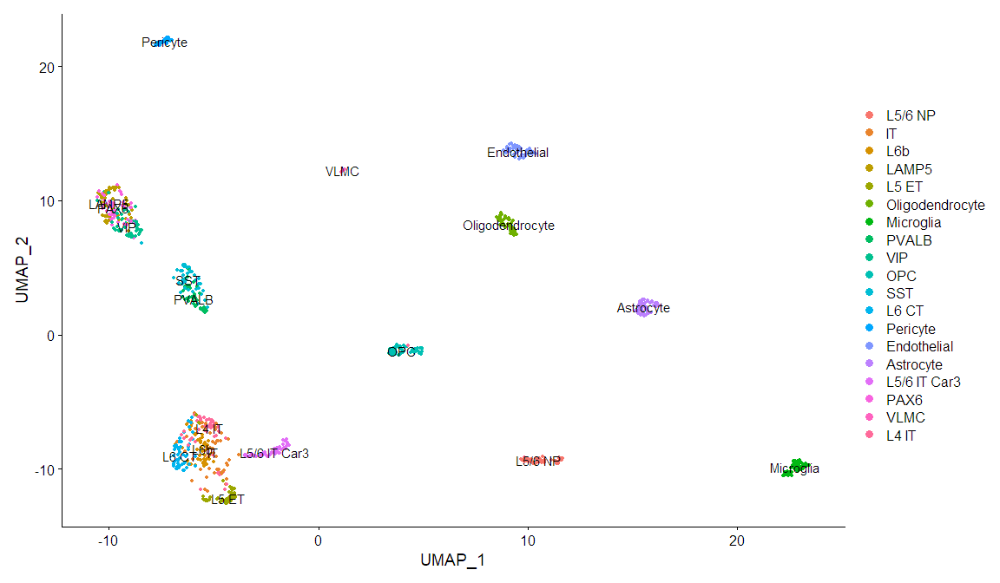
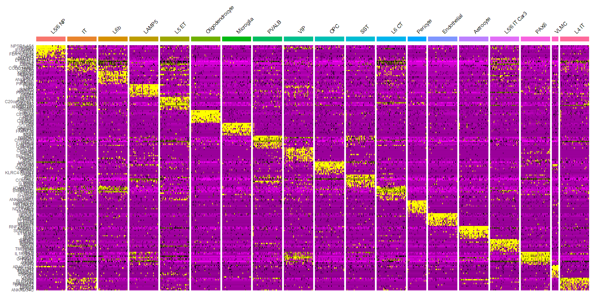
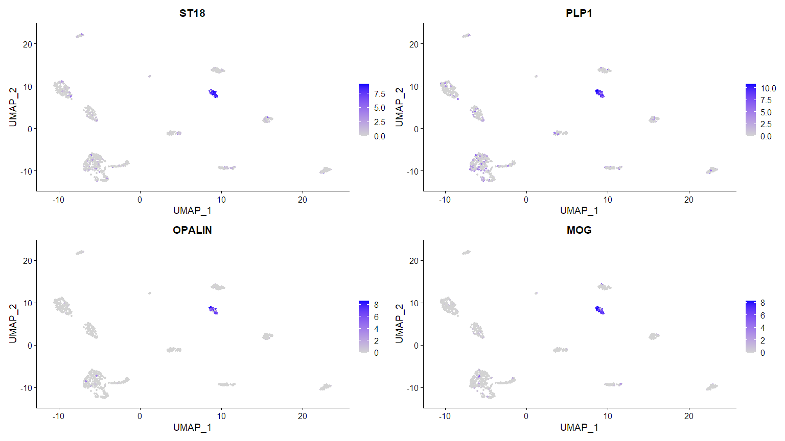

### **About `.Rmd` files**

This is an R Markdown notebook, where chunks of code can be executed independently and the output is visible immediately beneath the input. Accordingly, related lines of code can be organized and executed together. 

To do this click the green "play" icon at the top right of the chunk, or Ctrl + Shift + Enter (macOS: Cmd + Shift + Enter) to run the current chunk. An indicator will appear on the left margin to show you execution progress. Lines of code that have been sent to R are marked with dark green; lines that have not yet been sent to R are marked with light green.

The current working directory inside a notebook chunk is always the directory containing the notebook .Rmd file. You’ll get a warning if you try to change the working directory inside a notebook chunk, and the directory will revert back to the notebook’s directory once the chunk is finished executing.

Lastly, Markdown notebooks can easily be converted or "knit" into formats such as HTML, PDF, and Word for reproducible sharing of R code and figures. 

If you wish to learn more visit: https://bookdown.org/yihui/rmarkdown/

### **About this tutorial**

**Main learning objective:** become familiar with single-cell RNA sequencing data and how to analyze its features using Seurat.  

Furthermore, you will:

  * Be introduced to the concept of "reads" and "counts"
  * Import and normalize a counts matrix
  * Perform dimensionality reduction 
  * Visualize clusters of cells
  * Visualize gene expression across cells
  * Identify cell type-specific marker genes (i.e. differential expressed genes, DEGs)
  
### **Load packages**

We will begin by loading the packages necessary for this tutorial, which are already installed in your docker container. If the package is not loading, uncomment the line for installing it. 

`Tidyverse` is a collection of R packages that share a simple syntax for data structures    
`Seurat` is an R toolkit for single cell genomics. (Satija et al., 2015; Hao et al., 2021; https://satijalab.org/seurat/index.html)   
`MAST` is the statistical approach we will use to find DEGs (Finak et al., 2015)    


```r
# install.packages("tidyverse")
library(tidyverse)

# install.packages("Seurat") # install Seurat, as needed 
library(Seurat) 

# install.packages("BiocManager") # MAST is a bioconductor package, install BiocManager as needed
# BiocManager::install("MAST") # install MAST, as needed
library(MAST)

# install.packages("knitr")
library(knitr) # for markdown formatting
```

### **Load data**

The dataset we're working with includes 893 human cells from multiple cortical areas collected by the Allen Institute for Brain Science (AIBS) using scRNA-seq. Learn more here: https://portal.brain-map.org/explore/classes

First, let's get the metadata for our cells.


```r
# get metadata for each cell
# includes sample id, brain region, cortical layer, and cell-type labels curated by the AIBS
meta_data = read.csv(file = "./data/AIBS_scRNAseq_2019_human_metadata_downsampled.csv")
# set transcriptomic sample id as the rownames, this is important for Seurat 
rownames(meta_data) = meta_data$sample_name
# preview 
kable(meta_data[1:5,1:12], row.names = F)
```


|sample_name         |exp_component_name |specimen_type |cluster_color | cluster_order|cluster_label           |class_color | class_order|class_label   |subclass_color | subclass_order|subclass_label |
|:-------------------|:------------------|:-------------|:-------------|-------------:|:-----------------------|:-----------|-----------:|:-------------|:--------------|--------------:|:--------------|
|F2S4_160113_044_A01 |LS-15028_S65_E1-50 |nucleus       |#3DAD5E       |           107|Exc L5-6 FEZF2 MYBPHL   |#AFCC3D     |           2|Glutamatergic |#006B99        |             12|L5/6 NP        |
|F2S4_160113_045_D01 |LS-15028_S76_E1-50 |nucleus       |#23D385       |            79|Exc L4-5 RORB LINC01474 |#AFCC3D     |           2|Glutamatergic |#52FF26        |              7|IT             |
|F2S4_160421_034_B01 |LS-15092_S26_E1-50 |nucleus       |#174ABE       |            98|Exc L6 FEZF2 KRT17      |#AFCC3D     |           2|Glutamatergic |#4DFFC9        |             10|L6b            |
|F2S4_160421_039_E01 |LS-15092_S69_E1-50 |nucleus       |#3DAD5E       |           107|Exc L5-6 FEZF2 MYBPHL   |#AFCC3D     |           2|Glutamatergic |#006B99        |             12|L5/6 NP        |
|F1S4_160317_001_B01 |LS-15093_S66_E1-50 |nucleus       |#8A5860       |             4|Inh L6 LAMP5 C1QL2      |#0066FF     |           4|GABAergic     |#FF7373        |              1|LAMP5          |

Next we'll import our gene expression data. 

RNA-seq generally begins with the isolation and purification of RNA. RNA fragments are converted to cDNA, which are flanked by specific "adapter" sequences and amplified by PCR. These steps are referred to as "library preparation." 

The cDNA library is then sequenced. Each raw *read* is the sequence of nucleotide bases of a cDNA molecule. 

Reads generated by RNA-seq experiments must ultimately be aligned, or "mapped" to a reference genome. Read alignment to a reference provides biological information in two basic ways: 

  * First, it generates a dictionary of the genomic features represented in each sample. Aligned reads become annotated, and the highly fragmented sampling of RNA sequences is connected to the gene families, individual transcripts, small RNAs, or individual exons expressed in the original tissue sample or cell.

  * Second, the number of reads aligned to each feature approximates abundances of those features in the original sample. This is the *counts matrix* that we import here. Each column represents an individual cell and each row represents a gene. The integers in each cell is a *count* of the reads that map onto each gene per sample. 


```r
# get counts matrix
counts_matrix = read.csv(file = "./data/AIBS_scRNAseq_2019_human_matrix_downsampled.csv", 
                         row.names = 1, # set the gene names in the first column to rownames 
                         check.names = FALSE) # prevent automatic renaming of columns)
# preview 
kable(counts_matrix[10:18,1:8])
```


|        | F2S4_160113_044_A01| F2S4_160113_045_D01| F2S4_160421_034_B01| F2S4_160421_039_E01| F1S4_160317_001_B01| F2S4_160421_045_C01| F2S4_160421_047_G01| F2S4_160421_050_A01|
|:-------|-------------------:|-------------------:|-------------------:|-------------------:|-------------------:|-------------------:|-------------------:|-------------------:|
|A2M-AS1 |                   0|                   0|                   0|                   0|                   0|                   0|                  36|                   0|
|A2ML1   |                   0|                   1|                  50|                   0|                   0|                  11|                   1|                   1|
|A2MP1   |                   0|                   0|                   0|                   0|                   0|                   0|                   0|                   1|
|A3GALT2 |                   0|                   0|                   0|                   0|                   0|                   3|                   0|                   0|
|A4GALT  |                   0|                   0|                   0|                   0|                   0|                   0|                   0|                   0|
|A4GNT   |                   0|                   0|                   0|                   0|                   1|                   0|                   0|                   0|
|AA06    |                   0|                   0|                   0|                   0|                   0|                   0|                   0|                   0|
|AAAS    |                   0|                   0|                  71|                 106|                 608|                  62|                   0|                   1|
|AACS    |                 118|                   1|                 162|                 123|                 211|                  47|                   2|                  65|

### **Create Seurat object and normalize**

We can now create our Seurat object, which stores our counts matrix, metadata, and the results of any normalization step or analyses.


```r
# create our Seurat object
seu_obj  = CreateSeuratObject(count = counts_matrix, 
                              meta.data = meta_data) 
# the number of genes (features) and cells (samples)
# matches the corresponding dimensions of our initial data
seu_obj
```

```
## An object of class Seurat 
## 50281 features across 893 samples within 1 assay 
## Active assay: RNA (50281 features, 0 variable features)
```

```r
# note where our data is stored 
kable(seu_obj@meta.data[1:5,1:8])
```


|                    |orig.ident | nCount_RNA| nFeature_RNA|sample_name         |exp_component_name |specimen_type |cluster_color | cluster_order|
|:-------------------|:----------|----------:|------------:|:-------------------|:------------------|:-------------|:-------------|-------------:|
|F2S4_160113_044_A01 |F2S4       |    1759514|         9851|F2S4_160113_044_A01 |LS-15028_S65_E1-50 |nucleus       |#3DAD5E       |           107|
|F2S4_160113_045_D01 |F2S4       |    1506733|        10402|F2S4_160113_045_D01 |LS-15028_S76_E1-50 |nucleus       |#23D385       |            79|
|F2S4_160421_034_B01 |F2S4       |    1912318|        10969|F2S4_160421_034_B01 |LS-15092_S26_E1-50 |nucleus       |#174ABE       |            98|
|F2S4_160421_039_E01 |F2S4       |    2088745|        10642|F2S4_160421_039_E01 |LS-15092_S69_E1-50 |nucleus       |#3DAD5E       |           107|
|F1S4_160317_001_B01 |F1S4       |    2125754|         8728|F1S4_160317_001_B01 |LS-15093_S66_E1-50 |nucleus       |#8A5860       |             4|

```r
kable(seu_obj@assays$RNA@counts[15:20,1:8])
```


|       | F2S4_160113_044_A01| F2S4_160113_045_D01| F2S4_160421_034_B01| F2S4_160421_039_E01| F1S4_160317_001_B01| F2S4_160421_045_C01| F2S4_160421_047_G01| F2S4_160421_050_A01|
|:------|-------------------:|-------------------:|-------------------:|-------------------:|-------------------:|-------------------:|-------------------:|-------------------:|
|A4GNT  |                   0|                   0|                   0|                   0|                   1|                   0|                   0|                   0|
|AA06   |                   0|                   0|                   0|                   0|                   0|                   0|                   0|                   0|
|AAAS   |                   0|                   0|                  71|                 106|                 608|                  62|                   0|                   1|
|AACS   |                 118|                   1|                 162|                 123|                 211|                  47|                   2|                  65|
|AACSP1 |                   0|                   0|                   0|                  59|                   0|                   0|                   0|                   1|
|AADAC  |                   0|                   0|                   0|                   0|                   0|                   0|                   0|                   0|

We next need to normalize our count data. This is important to consider as, for example, we do not want to confound increased gene expression because of biological reasons with increased RNA amplification due to technical differences. 

By default, we employ a global-scaling normalization method “LogNormalize” that normalizes the feature expression measurements for each cell by the total expression, multiplies this by a scale factor, and log-transforms the result. 


```r
# normalize counts data in seurat object
# we use a scale factor of 1 million to convert our values to counts-per-million
seu_obj = NormalizeData(seu_obj, 
                        normalization.method = "LogNormalize", 
                        scale.factor = 1000000)
# preview normalized data
kable(seu_obj@assays$RNA@data[15:20,1:8])
```


|       | F2S4_160113_044_A01| F2S4_160113_045_D01| F2S4_160421_034_B01| F2S4_160421_039_E01| F1S4_160317_001_B01| F2S4_160421_045_C01| F2S4_160421_047_G01| F2S4_160421_050_A01|
|:------|-------------------:|-------------------:|-------------------:|-------------------:|-------------------:|-------------------:|-------------------:|-------------------:|
|A4GNT  |            0.000000|           0.0000000|            0.000000|            0.000000|            0.385549|            0.000000|           0.0000000|           0.0000000|
|AA06   |            0.000000|           0.0000000|            0.000000|            0.000000|            0.000000|            0.000000|           0.0000000|           0.0000000|
|AAAS   |            0.000000|           0.0000000|            3.640941|            3.946389|            5.659539|            3.406223|           0.0000000|           0.7329162|
|AACS   |            4.220448|           0.5090366|            4.451015|            4.092460|            4.607756|            3.139766|           0.6187562|           4.2665336|
|AACSP1 |            0.000000|           0.0000000|            0.000000|            3.375764|            0.000000|            0.000000|           0.0000000|           0.7329162|
|AADAC  |            0.000000|           0.0000000|            0.000000|            0.000000|            0.000000|            0.000000|           0.0000000|           0.0000000|

### **Dimensionality reduction and clustering**

Our Seurat object already contains metadata labels assigning each cell to a cell type subclass curated by the AIBS. Some steps involved in classifying cells include dimensionality reduction and clustering.

First, we apply a linear transformation (‘scaling’) that is a standard pre-processing step prior to dimensional reduction techniques like Principal Component Analysis (PCA). This shifts the expression of each gene, so that the mean expression across cells is 0 and the variance across cells is 1. This step gives equal weight in downstream analyses, so that highly-expressed genes do not dominate. 

PCA is the process of identifying a series of orthogonal vectors that iteratively capture the greatest amount of variance in the data. The aim of this approach is to adequately summarize the high-dimensional relationships of the original data in a lower-dimensional space. 

We perform PCA and order both cells and features according to their PCA scores for visualization. 


```r
# scale for all genes
seu_obj = ScaleData(seu_obj, 
                    features = rownames(seu_obj)) 
```

```
## Centering and scaling data matrix
```

```r
# run PCA
seu_obj = RunPCA(seu_obj,
                 features = rownames(seu_obj), 
                 verbose = FALSE)
# preview principal components (PCs)
print(seu_obj@reductions$pca, dims = 1:5, nfeatures = 5)
```

```
## PC_ 1 
## Positive:  SLC1A3, ZBTB20, MAML2, LOC339975, QKI 
## Negative:  DCLK1, SLC4A10, STXBP5L, FRMPD4, MEG3 
## PC_ 2 
## Positive:  HSPA8, TMSB4X, PPIAP22, RNASEK, CFL1 
## Negative:  LOC100128906, LOC101928286, DNAH17, SCHLAP1, LOC105377056 
## PC_ 3 
## Positive:  SATB2, SV2B, SLC17A7, CADPS2, TESPA1 
## Negative:  GAD1, NXPH1, GAD2, ERBB4, ZNF536 
## PC_ 4 
## Positive:  RNF219-AS1, ETNPPL, FGFR3, LINC00499, SLC25A18 
## Negative:  SRGAP2B, SRGAP2, MEF2C, ITGAX, DOCK8 
## PC_ 5 
## Positive:  LOC101929249, MOG, CNDP1, ST18, UGT8 
## Negative:  RBMS3, ABLIM1, NEBL, SAT1, LOC101927437
```

```r
# visualize cells and features for first two PCs
DimHeatmap(seu_obj, dims = 1:2, cells = 300, nfeatures = 50, balanced = TRUE)
```

<!-- -->

Next well use a graph-based clustering approach to group similar cells. 

`FindNeighbors` computes a K-nearest neighbor (KNN) graph based on euclidean distances in PCA space, calculated previously. "Edges" (straight lines) are drawn between two cells with similar feature expression patterns. Edge weights are then refined and the graph is partitioned into highly interconnected "communities." 

`FindClusters` uses modularity optimization techniques such as the Louvain algorithm, which are outside the scope of this tutorial. 


```r
# create KNN graph of data
seu_obj = FindNeighbors(seu_obj, verbose = F) 
# find clusters using default parameters 
seu_obj = FindClusters(seu_obj, verbose = F)
# run umap for a number of dimensions (from PCA), we'll go with 10
seu_obj = RunUMAP(seu_obj, dims = 1:10, verbose = F) 

# Visualize clusters 
# we use umap as our reduction method; we could put PCA here, but it would be harder to interpret 
DimPlot(seu_obj,
        reduction = "umap", 
        label = TRUE) + # show the labels of our clusters 
        NoLegend()
```

<!-- -->

The AIBS has provided cell type classification in their metadata. We can visualize these groups on our umap plot. 


```r
# The Idents() function lets us specify which grouping variable we want to work with
Idents(seu_obj) =  "subclass_label" 

### run the same code to generate our UMAP plot, but now we have different active "identities" due to the code above
DimPlot(seu_obj, 
        reduction = "umap", 
        label = TRUE) 
```

<!-- -->

### **Find cell-type markers**

We are ready to find cell-type markers. There are a few different options available to us depending on our needs. However, all methods require us to first specify how we are grouping cells. For example, we might want to group cells by cell class (such as inhibitory neurons) or subclass (such as SST cells). Or maybe we want to compare gene expression between cells from different brain regions. To specify this, we set the active "identities" of cells in our Seurat object to a metadata variable/column within the Seurat object.


```r
# set active identity
Idents(seu_obj) = "subclass_label" 
# see the cell types we'll be contrasting to find markers 
unique(seu_obj$subclass_label)
```

```
##  [1] "L5/6 NP"         "IT"              "L6b"             "LAMP5"          
##  [5] "L5 ET"           "Oligodendrocyte" "Microglia"       "PVALB"          
##  [9] "VIP"             "OPC"             "SST"             "L6 CT"          
## [13] "Pericyte"        "Endothelial"     "Astrocyte"       "L5/6 IT Car3"   
## [17] "PAX6"            "VLMC"            "L4 IT"
```

Seurat can help you find markers that define cell subtypes via differential expression between them.


```r
# find markers for all cell subtypes 
all_markers = FindAllMarkers(object = seu_obj,
                             logfc.threshold = 2.5, # only test genes with >2.5x log-fold change between groups compared 
                             min.pct = .35, # only test genes detected over this fraction of cells for the group of interest
                             only.pos = T, # only return positive markers (enriched in the cell group of interest)
                             test.use = "MAST", # the statistical test to use
                             verbose = F) %>% 
  rename_at("cluster", ~ "subclass_label") # rename column, necessary for merge()
# preview of our results
kable(all_markers[1:10,]) 
```


|             | p_val| avg_log2FC| pct.1| pct.2| p_val_adj|subclass_label |gene         |
|:------------|-----:|----------:|-----:|-----:|---------:|:--------------|:------------|
|NPSR1-AS1    |     0|   6.554030|  1.00| 0.413|         0|L5/6 NP        |NPSR1-AS1    |
|HTR2C        |     0|   5.548581|  0.94| 0.420|         0|L5/6 NP        |HTR2C        |
|TSHZ2        |     0|   4.419616|  1.00| 0.674|         0|L5/6 NP        |TSHZ2        |
|IFNG-AS1     |     0|   6.576408|  0.84| 0.034|         0|L5/6 NP        |IFNG-AS1     |
|TLL1         |     0|   3.861095|  0.94| 0.294|         0|L5/6 NP        |TLL1         |
|CD36         |     0|   6.003043|  0.70| 0.077|         0|L5/6 NP        |CD36         |
|CD200R1L     |     0|   6.212289|  0.62| 0.018|         0|L5/6 NP        |CD200R1L     |
|LOC105378334 |     0|   3.532228|  1.00| 0.453|         0|L5/6 NP        |LOC105378334 |
|LOC729732    |     0|   3.494547|  1.00| 0.764|         0|L5/6 NP        |LOC729732    |
|FER1L6-AS2   |     0|   4.786921|  0.84| 0.087|         0|L5/6 NP        |FER1L6-AS2   |

```r
# expression heatmap of cells and features
# get top 5 markers for each subclass label
top_genes = all_markers %>%
  group_by(subclass_label) %>%
  top_n(n = 10, wt = avg_log2FC)
# plot
DoHeatmap(seu_obj, features = top_genes$gene, size = 4) + 
  NoLegend()
```

<!-- -->

Save marker genes for later. These can be used for many applications. 


```r
# keep track of the class-level classifications (e.g. Glutamatergic) for later 
# merge class_labels from metadata by matching to subclass labels 
all_markers = merge(all_markers, distinct(meta_data, class_label, subclass_label, .keep_all = F), by = "subclass_label")
# rearrange columns 
all_markers = all_markers %>% 
  dplyr::select(gene, subclass_label, class_label, everything())

# save
write.csv(all_markers, file = "./data/human_markers.csv")
```

We are using some sample threshold values for logfc.threshold and min.pct here. These are values chosen based on our previous work and experience. These values may be considered somewhat high, meaning that fewer genes will pass the threshold for testing and that less time will be needed to run `FindAllMarkers`. In a more serious analysis, we would adjust these thresholds based on multiple factors.

If we are not interested in all groups, but rather are interested in only one or a few subclasses, we can use the `FindMarkers` function instead.


```r
# Using the oligodendrocyte subclass as an example
olgio_markers = FindMarkers(object = seu_obj, 
                            ident.1 = "Oligodendrocyte", # specify our group of interest here
                            logfc.threshold = 2.5, 
                            min.pct = .35, 
                            only.pos = T,
                            test.use = "MAST",
                            verbose = F) %>%
# sort by high to low average log-fold change
  arrange(desc(avg_log2FC))
# preview our results
head(olgio_markers)
```

```
##                      p_val avg_log2FC pct.1 pct.2     p_val_adj
## ST18         5.746033e-135   9.465716  0.98 0.267 2.889163e-130
## PLP1         1.067835e-103   9.392204  1.00 0.265  5.369179e-99
## OPALIN        4.342331e-72   9.308391  0.88 0.037  2.183368e-67
## MOG           9.960100e-88   9.253918  0.92 0.095  5.008038e-83
## CNDP1        3.439186e-109   9.012204  0.96 0.227 1.729257e-104
## LOC101927459  1.011251e-69   8.786082  0.82 0.134  5.084674e-65
```

```r
# we can use violin plots to verify that our top oligodendrocyte markers are indeed enriched in our oligodendrocyte cluster (green)
VlnPlot(seu_obj, 
        features = rownames(olgio_markers)[1:3])
```

<!-- -->

```r
# similarly, we can visualize marker expression on our umap plot
FeaturePlot(seu_obj, 
            features = rownames(olgio_markers)[1:4])
```

<!-- -->

Note the arguments are largely the same between `FindMarkers` and `FindAllMarkers`. The code above compares oligodendrocyte cells with a group containing all other cells in the dataset. If we wanted to compare between cells of two specific groups defined in `subclass_label`, we can use the "ident.2" argument in `FindMarkers`.


```r
# For example, we want to find positive markers in SST cells but only compared to VIP cells
SST_vs_VIP_markers = FindMarkers(object = seu_obj, 
                                 ident.1 = "SST", 
                                 ident.2 = "VIP", # setting the specific "other" group to compare  
                                 logfc.threshold = 2.5, 
                                 min.pct = .35, 
                                 only.pos = T,
                                 test.use = "MAST",
                                 verbose = F) 
head(SST_vs_VIP_markers) # preview our results
```

```
##               p_val avg_log2FC pct.1 pct.2    p_val_adj
## NXPH1  5.848564e-32   5.366028  1.00  0.42 2.940716e-27
## SOX6   2.056733e-30   8.036874  0.98  0.30 1.034146e-25
## RALYL  1.096747e-26   5.890077  1.00  0.74 5.514555e-22
## SATB1  1.497168e-23   4.521683  1.00  0.32 7.527909e-19
## GRIK3  3.218368e-23   5.840476  0.98  0.22 1.618228e-18
## STXBP6 1.994201e-21   4.944579  0.98  0.28 1.002704e-16
```

This concludes the tutorial on Seurat. 

Sources: 

1. https://satijalab.org/seurat/index.html
2. https://github.com/RGLab/MAST
3. https://portal.brain-map.org/atlases-and-data/rnaseq/human-multiple-cortical-areas-smart-seq
4. https://rnaseq.uoregon.edu/#exp-design 


