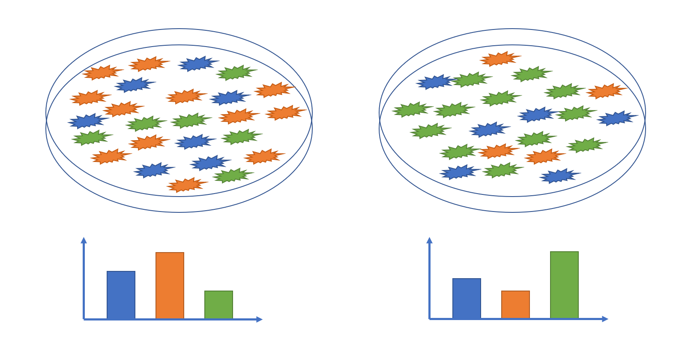
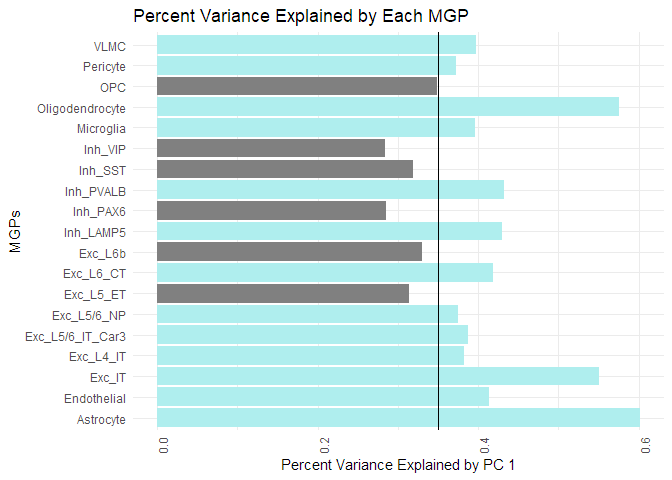
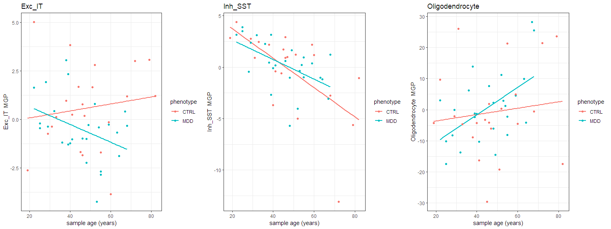
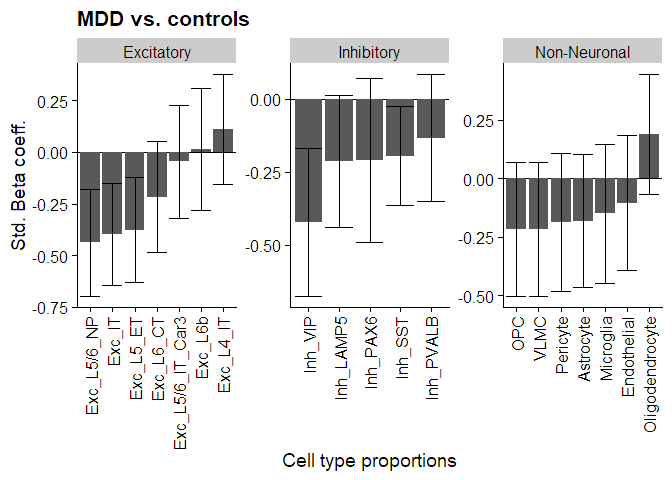
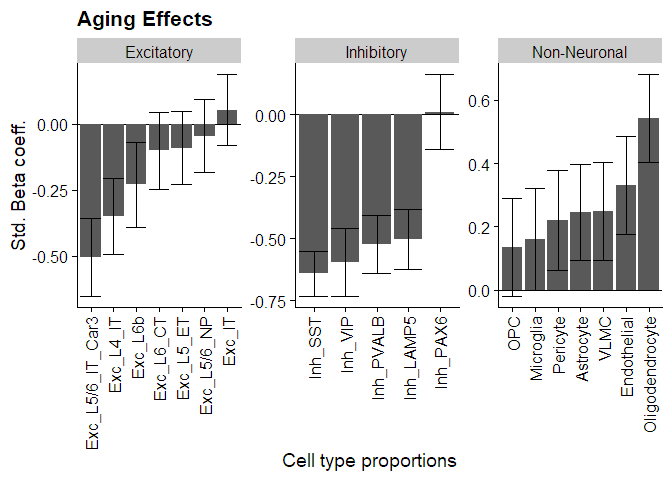

### **About this tutorial**

**Main learning objective:** perform cell-type deconvolution to estimate how proportions of cell-types in the brain change in response to various conditions. You can learn more about the Marker Gene Profiles tool by reading the documentation and by reading [Mancarci et al. 2017](https://doi.org/10.1523/ENEURO.0212-17.2017 ) that describes it in greater detail.

We will use `Marker Gene Profiles`, a computational technique that attempts to decompose bulk tissue gene expression into a list of cell-types proportion estimates. 

Cell-type deconvolution requires three components:

1. A set of marker genes per cell type that you want to estimate. We will use the markers that you generated in `tutorial 01` from human scRNA-seq data. 
2. Gene expression measured in bulk tissue samples. We'll use the data generated by [Labonte et al. (2017)](https://doi.org/10.1038/nm.4386)
3. A scientific question you're interested in. We're investigating what cell-types change in response to natural aging and major depression (MDD).




### **Load packages**

We will begin by loading the packages necessary for this tutorial, which are already installed in your docker container. If the package is not loading, uncomment the line for installing it. 


```r
#BiocManager::install("edgeR")
library(edgeR)
#devtools::install_github('oganm/markerGeneProfile', force = T) # install marker gene profile tool from github
library(markerGeneProfile)
#install.packages("tidyverse")
library(tidyverse)
#install.packages("matrixStats")
library(matrixStats)
#install.packages("cowplot")
library(cowplot)
#install.packages("broom")
library(broom)
#install.packages("knitr")
library(knitr)
#install.packages("ggpubr")
library(ggpubr)
theme_set(theme_cowplot())
```

### **Load data**

Next, import the metadata and counts matrix for the bulk RNA-seq we're analyzing. 


```r
# import metadata
labonte_meta = read_csv(file = "./data/GSE102556-metadata.csv") %>%
  # grab specific columns and rename for clarity
  select(geo_accession, 
         expr_names, 
         age = age.ch1, 
         gender = gender.ch1, 
         pmi = pmi.ch1, 
         rin = rin.ch1, 
         ph = ph.ch1, 
         phenotype = phenotype.ch1)
# preview 
kable(labonte_meta[1:5,])
```


|geo_accession |expr_names | age|gender |   pmi| rin|   ph|phenotype |
|:-------------|:----------|---:|:------|-----:|---:|----:|:---------|
|GSM2740657    |X14.BA8_9  |  47|Male   | 12.00| 7.8| 6.49|CTRL      |
|GSM2740658    |X17.BA8_9  |  41|Male   | 24.00| 7.6| 6.00|CTRL      |
|GSM2740659    |X20.BA8_9  |  31|Male   | 29.50| 6.9| 6.67|CTRL      |
|GSM2740660    |X23.BA8_9  |  19|Male   | 27.75| 7.7| 6.74|CTRL      |
|GSM2740661    |X28.BA8_9  |  46|Male   | 19.50| 7.7| 6.42|CTRL      |

```r
# import expression matrix 
labonte_counts = read_tsv("./data/GSE102556-expression-counts.txt") %>%
  # grab column with gene names and samples from the metadata file 
  select(c("gene_symbol", labonte_meta$geo_accession)) %>%
  # remove periods and numbers in gene names used to avoid duplicates 
  mutate(gene_symbol = gsub("\\..*", "", gene_symbol)) %>%
  # filter duplicated genes 
  filter(duplicated(gene_symbol) == FALSE) %>%
  # convert gene_symbol column to rownames 
  column_to_rownames(var = "gene_symbol")

# preview 
kable(labonte_counts[1:5, 1:10])
```


|      | GSM2740657| GSM2740658| GSM2740659| GSM2740660| GSM2740661| GSM2740662| GSM2740663| GSM2740664| GSM2740665| GSM2740666|
|:-----|----------:|----------:|----------:|----------:|----------:|----------:|----------:|----------:|----------:|----------:|
|A1BG  |        147|        194|        268|        175|        133|        288|        162|        235|        238|        155|
|A1CF  |         37|         70|         61|         19|         71|         92|         51|         66|         54|         26|
|A2M   |       2539|       2719|       3594|       3405|       2087|       2374|       2619|       5051|       3779|       4542|
|A2ML1 |        129|        162|        208|        169|        133|        205|        125|        217|        214|        171|
|A2MP1 |         36|         87|         89|         67|         56|         80|         71|        113|         79|         58|

### **Normalize and process**

Because of possible differences in sequencing depth between different bulk brain gene expression samples, we will normalize for these differences using the [Counts Per Million](https://rdrr.io/bioc/edgeR/man/cpm.html) metric in the [`edgeR` package.](https://www.ncbi.nlm.nih.gov/pmc/articles/PMC2796818/).   


```r
# normalize using CPM, add 0.1 to every observation, and log2 transform 
labonte_cpm = edgeR::cpm(labonte_counts, log = TRUE, prior.count = 0.1)
# preview
kable(labonte_cpm[1:5, 1:10])
```


|      | GSM2740657| GSM2740658| GSM2740659| GSM2740660| GSM2740661| GSM2740662| GSM2740663| GSM2740664| GSM2740665| GSM2740666|
|:-----|----------:|----------:|----------:|----------:|----------:|----------:|----------:|----------:|----------:|----------:|
|A1BG  |   3.216664|   2.933249|   3.596465|  2.8763379|   2.424683|   3.588944|  2.5975636|   2.997711|  3.0433369|  2.3916043|
|A1CF  |   1.227975|   1.463728|   1.462455| -0.3216042|   1.519926|   1.943428|  0.9318589|   1.167122|  0.9053833| -0.1795624|
|A2M   |   7.326552|   6.741614|   7.341384|  7.1579475|   6.395781|   6.631774|  6.6117720|   7.422976|  7.0317638|  7.2637107|
|A2ML1 |   3.028291|   2.673310|   3.230930|  2.8260294|   2.424683|   3.098660|  2.2237319|   2.882795|  2.8900512|  2.5332471|
|A2MP1 |   1.188503|   1.777050|   2.006905|  1.4922662|   1.177981|   1.741981|  1.4084738|   1.942020|  1.4534678|  0.9749854|

Find genes with low standard deviations and remove them from the expression matrix.


```r
# calculate standard deviation per row
gene_sds = rowSds(labonte_cpm, na.rm = T) 
# keep rows (genes) with sd greater than 0.1 across all samples 
gene_mat = labonte_cpm[gene_sds > .1, ] %>%
  as.data.frame() %>%
  rownames_to_column(var = "gene_symbol")
```

### **Cell-proportion estimation**

Import the marker gene list you created in `tutorial 1` and reformat.


```r
# import from folder 
marker_data = read.csv(file = "./data/human_markers.csv")[-1] %>%
  # convert class labels to abbreviations
  mutate(class_label = case_when(
    class_label == "Glutamatergic" ~ "Exc",
    class_label == "GABAergic" ~ "Inh")
    ) %>%  
  # add as prefix to subclass labels 
  unite(subclass_label, c(class_label, subclass_label), sep = "_", remove = F, na.rm = T)
# fix any spaces
marker_data$subclass_label = gsub(" ", "_", marker_data$subclass)
# add non-neuronal label back 
marker_data$class_label[is.na(marker_data$class_label)] = "NonN"

# check matches between markers and bulk RNA-seq genes 
paste("marker matches in data: ", length(intersect(unlist(gene_mat$gene), unlist(marker_data$gene))), "/", nrow(marker_data))
```

```
## [1] "marker matches in data:  2255 / 3203"
```

```r
# get vector of unique cell types 
cell_types = marker_data$subclass_label %>% unique()
print(cell_types)
```

```
##  [1] "Astrocyte"        "Endothelial"      "Exc_IT"           "Exc_L4_IT"       
##  [5] "Exc_L5_ET"        "Exc_L5/6_IT_Car3" "Exc_L5/6_NP"      "Exc_L6_CT"       
##  [9] "Exc_L6b"          "Inh_LAMP5"        "Microglia"        "Oligodendrocyte" 
## [13] "OPC"              "Inh_PAX6"         "Pericyte"         "Inh_PVALB"       
## [17] "Inh_SST"          "Inh_VIP"          "VLMC"
```

```r
# organize markers into a list, which is the format will need for next steps 
marker_list = lapply(cell_types, function(cell_type){
  return(marker_data %>% filter(subclass_label == cell_type) %>% pull(gene) %>% unlist())
  })
names(marker_list) = cell_types
```

Run `mgpEstimate` to get cell type proportions for each bulk tissue sample. 


```r
# Run marker gene profile (MGP) analysis
estimations =  mgpEstimate(
  exprData = gene_mat,
  genes = marker_list,
  geneColName = 'gene_symbol',
  outlierSampleRemove = FALSE, # should outlier samples removed. This is done using boxplot stats
  geneTransform = NULL, # this is the default option for geneTransform
  groups = NULL, # if there are experimental groups provide them here. if not desired set to NULL
  seekConsensus = FALSE, # ensures gene rotations are positive in both of the groups
  removeMinority = TRUE)

# get proportion estimates as data frame
estimations_df = as.data.frame(estimations$estimates) %>%
  rownames_to_column(var = "geo_accession")

# proportions are unit-less and negative numbers are just a result of PCA
# we can scale proportions between 0-1 for visualization purposes 
scale0 = function(x){
   (x-min(x))/(max(x)-min(x))
}
estimations_df_norm = scale0(estimations_df[,-1])
estimations_df_norm = estimations_df_norm %>%
  mutate(geo_accession = estimations_df$geo_accession) %>%
  dplyr::select(geo_accession, everything())

# merge cell type proportions with sample metadata
mgp_df = inner_join(labonte_meta, estimations_df_norm, by = "geo_accession") %>%
# pivot longer so there is one row per sample and cell type
# this type of data structure is preferred by ggplot
  pivot_longer(-colnames(labonte_meta),
               names_to = "cell_type",
               values_to = "cell_proportion")
# fix labels 
mgp_df$cell_type = gsub("\\.", "/", mgp_df$cell_type)
# preview 
kable(mgp_df[1:10,])
```


|geo_accession |expr_names | age|gender | pmi| rin|   ph|phenotype |cell_type        | cell_proportion|
|:-------------|:----------|---:|:------|---:|---:|----:|:---------|:----------------|---------------:|
|GSM2740657    |X14.BA8_9  |  47|Male   |  12| 7.8| 6.49|CTRL      |Astrocyte        |       0.4190530|
|GSM2740657    |X14.BA8_9  |  47|Male   |  12| 7.8| 6.49|CTRL      |Endothelial      |       0.4236108|
|GSM2740657    |X14.BA8_9  |  47|Male   |  12| 7.8| 6.49|CTRL      |Exc_IT           |       0.3883149|
|GSM2740657    |X14.BA8_9  |  47|Male   |  12| 7.8| 6.49|CTRL      |Exc_L4_IT        |       0.4157877|
|GSM2740657    |X14.BA8_9  |  47|Male   |  12| 7.8| 6.49|CTRL      |Exc_L5_ET        |       0.3699714|
|GSM2740657    |X14.BA8_9  |  47|Male   |  12| 7.8| 6.49|CTRL      |Exc_L5/6_IT_Car3 |       0.4012421|
|GSM2740657    |X14.BA8_9  |  47|Male   |  12| 7.8| 6.49|CTRL      |Exc_L5/6_NP      |       0.3751158|
|GSM2740657    |X14.BA8_9  |  47|Male   |  12| 7.8| 6.49|CTRL      |Exc_L6_CT        |       0.3622663|
|GSM2740657    |X14.BA8_9  |  47|Male   |  12| 7.8| 6.49|CTRL      |Exc_L6b          |       0.3989537|
|GSM2740657    |X14.BA8_9  |  47|Male   |  12| 7.8| 6.49|CTRL      |Inh_LAMP5        |       0.4302652|

### **Quality-control of cell-proportion estimates**

Let's take a look at some of the quality metrics we have available for MGP calculations when we use the `mgpEstimate` function.

We define our QC algorithm such that it returns a dataframe with the `cell type`, `markers_used` (list of marker genes used per cell type), `removed_marker_ratios` (list of removed marker ratios per cell type), and `percent_variance_PC1` (list of variance explained by the first PC per cell type)


```r
# loop through each cell type 
for(i in 1:length(cell_types)){
  # get the expression values of markers kept by mgpEstimate() per bulk sample 
  cells_df = estimations$usedMarkerExpression[i] %>% as.data.frame()
  # get list of markers kept by mgpEstimate()
  masterlist = paste0(rownames(cells_df), collapse=', ')
  # number of markers kept by mgpEstimate()
  num_markers = length(rownames(cells_df))
  # ratio of markers removed
  rm_marker_ratios = estimations$removedMarkerRatios[i]
  # check if the trimmed PCs are not(!) empty (NULL)
  if(!is.null(estimations$trimmedPCAs[[i]])){
    # get the percent variance that each principal component (PC) captures in the data 
    percent_variance = ((summary(estimations$trimmedPCAs[[i]]))[6]) %>% as.data.frame()
    # get the percent variance that the first principal component (PC1) captures in the data 
    percent_variance_PC1 = percent_variance[2,1]
  }
  else{
    # otherwise, the set this to NA
    percent_variance_PC1 = NA
  }
  # build a dataframe with all our metrics
  # initialize dataframe if this is the first iteration of the for() loop
  if(i==1){
    master_df = data.frame("markers_used" = masterlist, 
                           "removed_marker_ratios" = rm_marker_ratios,
                           "percent_variance_PC1" = percent_variance_PC1, 
                           "num_markers" = num_markers)  
  }
  # bind previous iterations results
  else{
    df = data.frame("markers_used" = masterlist, 
                    "removed_marker_ratios" = rm_marker_ratios,
                    "percent_variance_PC1" = percent_variance_PC1, 
                    "num_markers" = num_markers)
    master_df = rbind(master_df, df)
  }
}
QC_metrics = rownames_to_column(master_df, var = "celltype")
```

Let's plot these QC metrics to get a better idea of whats going on in the `mgpEstimate` function.


```r
QC_metrics %>%  ggplot(aes(x = celltype, y = num_markers)) +
      theme_minimal() +
      geom_bar(stat = "identity", fill = "#e0abf5") +
      geom_hline(yintercept = 4) + 
      labs(title="Plot of Number of Markers Per Celltype", 
           x="Cell Type", y = "Markers Used")+
      theme(axis.text.x = element_text(angle = 45, vjust = 0.5)) +
      coord_flip()
```

<!-- -->

We've drawn a line here where we consider there to be too few markers used to calculate the cell-type proportion estimate for it to be considered robust. Let's look at another measure of the quality of the MGPs, the percent variance explained by PC (principal component) 1. 


```r
QC_metrics %>%  ggplot(aes(x=celltype, y=percent_variance_PC1))+
  geom_bar(stat = "identity", fill =ifelse(QC_metrics$percent_variance_PC1 > 0.35, "#AFEEEE", "#808080")) +
  geom_hline(yintercept = 0.35) +
  labs(title="Percent Variance Explained by Each MGP",
        x="MGPs", y = "Percent Variance Explained by PC 1")+
  theme_minimal()+
  theme(axis.text.x = element_text(angle = 90)) + coord_flip()
```

<!-- -->

We consider more than 35% variance explained by PC1 (indicated by the horizontal line) to be a robust cell type proportion estimate. This means all the blue cell type proportion estimates (MGPs) are likely to be good surrogates for cell counts.

Now, let's plot marker gene proportions (MGPs) vs. sample age


```r
# create a vector of cell types to plot 
plot_genes = c("Exc_IT","Inh_SST","Oligodendrocyte")
# create a list to store plots generated within the for loop
plot_list = list()

# loop through vector of genes to plot
for(i in 1:length(plot_genes)){
  plot_list[[i]] = ggplot(
    # subset by cell type 
    mgp_df %>% filter(cell_type == plot_genes[i]),
    aes(x = age, y = cell_proportion, color = phenotype)) +
    geom_smooth(method = "lm", se = F) + 
    geom_point() +
    ggtitle(paste(plot_genes[i])) +
    ylab(paste(plot_genes[i], " MGP")) + xlab ("sample age (years)") +
    theme_bw() 
}
# bring plots together
plot_grid(plotlist = plot_list, nrow = 1)
```

```
## `geom_smooth()` using formula 'y ~ x'
## `geom_smooth()` using formula 'y ~ x'
## `geom_smooth()` using formula 'y ~ x'
```

<!-- -->

### **Linear models**

We will use R’s linear modeling function `lm` to fit a statistical model against each cell type proportion and a number of covariates, including gender, pH, RIN (RNA integrity number), PMI (post mortem interval), age, and phenotype (control / MDD).

The model form here is: `cell_type_prop ~ phenotype + gender + ph + rin + pmi + age`

To fit many models with broom, it’s useful to use pivot_longer to stack the data into one column - then group_by() to “split” the stacked data.


```r
# Linear modeling
lm_df = mgp_df %>%
  # each step performed after this line is done with each cell type 
  group_by(cell_type) %>%
  # fit cell type proportions according to this model  
  # using the broom package to tidy the results 
  do(tidy(lm(scale(cell_proportion) ~ phenotype + gender + scale(pmi) + scale(ph) + scale(rin) + scale(age),  data = .))) %>%
  # ungroup the data
  ungroup() %>%
  # adjust for multiple comparisons using the Benjamini-Hochberg method
  mutate(padj = p.adjust(`p.value`, method = 'BH')) %>%
  # clean up variable names 
  mutate(term = recode(term, 
                       `(Intercept)` = "Intercept", 
                       `genderMale` = "gender",
                       `scale(rin)` = "rin",
                       `scale(pmi)` = "pmi",
                       `scale(ph)` = "ph",
                       `scale(age)` = "age",
                       `phenotypeMDD` = "MDD")) %>%
  mutate(class = case_when(
    str_detect(cell_type, "Inh") ~ "Inhibitory",
    str_detect(cell_type, "Exc") ~ "Excitatory",
    TRUE ~ "Non-Neuronal"
  ))

# print data frame for just MDD beta coefficients
kable(lm_df %>% filter(term == 'MDD'))
```


|cell_type        |term |   estimate| std.error|  statistic|   p.value|      padj|class        |
|:----------------|:----|----------:|---------:|----------:|---------:|---------:|:------------|
|Astrocyte        |MDD  | -0.1814554| 0.2824241| -0.6424927| 0.5241301| 0.7464357|Non-Neuronal |
|Endothelial      |MDD  | -0.1048819| 0.2890632| -0.3628339| 0.7185929| 0.8115858|Non-Neuronal |
|Exc_IT           |MDD  | -0.3973346| 0.2481806| -1.6009901| 0.1170572| 0.3706812|Excitatory   |
|Exc_L4_IT        |MDD  |  0.1088939| 0.2665840|  0.4084790| 0.6850477| 0.8115858|Excitatory   |
|Exc_L5/6_IT_Car3 |MDD  | -0.0459116| 0.2718776| -0.1688687| 0.8667303| 0.9076782|Excitatory   |
|Exc_L5/6_NP      |MDD  | -0.4382747| 0.2592019| -1.6908622| 0.0984528| 0.3538978|Excitatory   |
|Exc_L5_ET        |MDD  | -0.3762635| 0.2543732| -1.4791788| 0.1467354| 0.4247805|Excitatory   |
|Exc_L6_CT        |MDD  | -0.2164139| 0.2703507| -0.8004932| 0.4280394| 0.7298620|Excitatory   |
|Exc_L6b          |MDD  |  0.0150031| 0.2954186|  0.0507858| 0.9597428| 0.9654755|Excitatory   |
|Inh_LAMP5        |MDD  | -0.2134051| 0.2241255| -0.9521680| 0.3465917| 0.6880104|Inhibitory   |
|Inh_PAX6         |MDD  | -0.2114222| 0.2803350| -0.7541769| 0.4550529| 0.7380736|Inhibitory   |
|Inh_PVALB        |MDD  | -0.1346649| 0.2169222| -0.6207982| 0.5381684| 0.7534358|Inhibitory   |
|Inh_SST          |MDD  | -0.1950828| 0.1687478| -1.1560613| 0.2543484| 0.5545628|Inhibitory   |
|Inh_VIP          |MDD  | -0.4210047| 0.2534309| -1.6612209| 0.1042983| 0.3650441|Inhibitory   |
|Microglia        |MDD  | -0.1511913| 0.2963048| -0.5102558| 0.6126085| 0.7910382|Non-Neuronal |
|Oligodendrocyte  |MDD  |  0.1867213| 0.2559009|  0.7296625| 0.4697449| 0.7437628|Non-Neuronal |
|OPC              |MDD  | -0.2178394| 0.2853736| -0.7633480| 0.4496262| 0.7380736|Non-Neuronal |
|Pericyte         |MDD  | -0.1880874| 0.2943114| -0.6390762| 0.5263279| 0.7464357|Non-Neuronal |
|VLMC             |MDD  | -0.2168155| 0.2857047| -0.7588797| 0.4522654| 0.7380736|Non-Neuronal |

```r
# print data frame for just age beta coefficients
kable(lm_df %>% filter(term == 'age'))
```


|cell_type        |term |   estimate| std.error|  statistic|   p.value|      padj|class        |
|:----------------|:----|----------:|---------:|----------:|---------:|---------:|:------------|
|Astrocyte        |age  |  0.2463604| 0.1522435|  1.6182001| 0.1132880| 0.3706812|Non-Neuronal |
|Endothelial      |age  |  0.3306262| 0.1558224|  2.1218146| 0.0399426| 0.2043218|Non-Neuronal |
|Exc_IT           |age  |  0.0526654| 0.1337842|  0.3936595| 0.6958723| 0.8115858|Excitatory   |
|Exc_L4_IT        |age  | -0.3500279| 0.1437047| -2.4357442| 0.0192950| 0.1243466|Excitatory   |
|Exc_L5/6_IT_Car3 |age  | -0.5041654| 0.1465583| -3.4400332| 0.0013496| 0.0128211|Excitatory   |
|Exc_L5/6_NP      |age  | -0.0445024| 0.1397254| -0.3184994| 0.7517230| 0.8262741|Excitatory   |
|Exc_L5_ET        |age  | -0.0906562| 0.1371224| -0.6611337| 0.5122249| 0.7464357|Excitatory   |
|Exc_L6_CT        |age  | -0.1007912| 0.1457352| -0.6916050| 0.4930834| 0.7464357|Excitatory   |
|Exc_L6b          |age  | -0.2295658| 0.1592483| -1.4415589| 0.1570218| 0.4314175|Excitatory   |
|Inh_LAMP5        |age  | -0.5033480| 0.1208170| -4.1662003| 0.0001556| 0.0029513|Inhibitory   |
|Inh_PAX6         |age  |  0.0088710| 0.1511174|  0.0587025| 0.9534743| 0.9654755|Inhibitory   |
|Inh_PVALB        |age  | -0.5229318| 0.1169341| -4.4720226| 0.0000602| 0.0018698|Inhibitory   |
|Inh_SST          |age  | -0.6418557| 0.0909652| -7.0560600| 0.0000000| 0.0000018|Inhibitory   |
|Inh_VIP          |age  | -0.5961769| 0.1366144| -4.3639374| 0.0000844| 0.0018698|Inhibitory   |
|Microglia        |age  |  0.1600091| 0.1597260|  1.0017719| 0.3223297| 0.6495432|Non-Neuronal |
|Oligodendrocyte  |age  |  0.5420832| 0.1379459|  3.9296794| 0.0003198| 0.0042527|Non-Neuronal |
|OPC              |age  |  0.1343605| 0.1538335|  0.8734152| 0.3875239| 0.7172334|Non-Neuronal |
|Pericyte         |age  |  0.2199408| 0.1586515|  1.3863141| 0.1731442| 0.4428497|Non-Neuronal |
|VLMC             |age  |  0.2481138| 0.1540120|  1.6110036| 0.1148519| 0.3706812|Non-Neuronal |

```r
# beta coeffs per cell type for phenotype 
beta_plot = lm_df %>% 
  filter(term %in% 'MDD') %>% 
  mutate(cell_type = fct_reorder(cell_type, estimate)) %>% 
  ggplot(aes(x = cell_type, y = estimate)) + 
  geom_hline(yintercept = 0) + 
  geom_bar(stat = "identity") + 
  geom_errorbar(aes(ymin = estimate - std.error, ymax = estimate + std.error)) + 
  ggtitle("MDD vs. controls") +
  ylab('Std. Beta coeff.') + 
  xlab('Cell type proportions') + 
  theme(axis.text.x = element_text(angle = 90, vjust = 0.5, hjust=1)) +
  facet_wrap(~class, drop = T, scale = "free")
beta_plot
```

<!-- -->

```r
# beta coeffs per cell type for age effects
beta_plot = lm_df %>% 
  filter(term %in% 'age') %>% 
  mutate(cell_type = fct_reorder(cell_type, estimate)) %>% 
  ggplot(aes(x = cell_type, y = estimate)) + 
  geom_hline(yintercept = 0) + 
  geom_bar(stat = "identity") + 
  geom_errorbar(aes(ymin = estimate - std.error, ymax = estimate + std.error)) + 
  ggtitle("Aging Effects") +
  ylab('Std. Beta coeff.') + 
  xlab('Cell type proportions') + 
  theme(axis.text.x = element_text(angle = 90, vjust = 0.5, hjust=1)) +
  facet_wrap(~class, drop = T, scale = "free")
beta_plot
```

<!-- -->

That concludes the mgpEstimate tutorial. 


